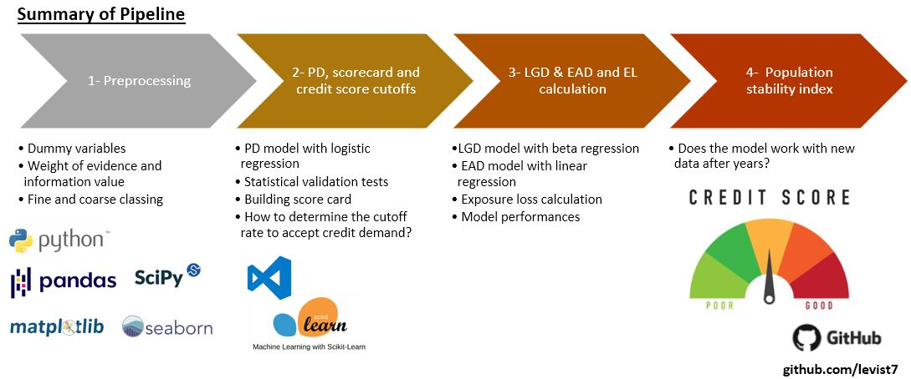

# Modélisation du Risque de Crédit | Calcul de PD, LGD, EAD et EL avec le Machine Learning en Python  


## Table des matières
* [Contexte](#contexte)
* [Projet](#projet)
* [Pipeline](#pipeline)
* [Documents clés](#documents-clés)
* [Jeux de données](#jeux-de-données)
* [Performances des modèles](#performances-des-modèles)  
* [Livrables](#livrables)
* [Démarrage](#démarrage)
* [Technologies](#technologies)
* [Structure du répertoire](#structure-du-répertoire)
* [Licence](#licence)
* [Auteur](#auteur)

## Contexte

La modélisation du risque de crédit est cruciale pour les institutions financières. Elle représente le risque qu’un emprunteur ne soit pas capable de rembourser un prêt, une carte de crédit ou d’autres formes de crédit. Dans certains cas, les emprunteurs ne remboursent qu’une partie du montant et ni le capital ni les intérêts ne sont entièrement payés. Les statistiques et le machine learning jouent un rôle clé pour traiter les big data et construire des modèles statistiques.

## Pipeline  



## Projet

Ce projet est basé sur l’intelligence artificielle pour modéliser le risque de crédit conformément aux accords de Bâle.

L’objectif est de construire un modèle de risque de crédit à partir de données de prêts afin de générer une carte de score utilisable au quotidien et un pipeline pour calculer la perte attendue en cas de défaut.

Voici les étapes, en conformité avec les exigences de Bâle II :

* Prétraitement — transformation des colonnes en variables indicatrices via un regroupement fin et grossier
* Calcul du modèle PD avec une régression logistique
* Création d’une carte de score au format CSV basée sur le modèle PD
* Construction du modèle LGD avec une régression bêta
* Construction du modèle EAD avec une régression linéaire
* Calcul de la perte attendue (EL) à partir de tous les modèles
* Vérification de la robustesse des modèles avec des données de risque de crédit plus récentes

> Ce notebook comprend mes révisions/ajouts du cours de modélisation du risque de crédit sur [365 Learning](https://365datascience.com/courses/credit-risk-modeling-in-python/).

## Documents clés
	
Notebooks décrits ci-dessous :  
**L01** - Notebook de prétraitement et d’ingénierie des variables  
**L02** - Notebook de modélisation de la probabilité de défaut (PD), génération de la carte de score, calcul du seuil  
**L03** - Notebook de modélisation de la perte en cas de défaut (LGD), de l’exposition au défaut (EAD) et de la perte attendue (EL)  
**L04** - Notebook de vérification de l’indice de stabilité de la population (PSI)

## Jeux de données

Le jeu de données provient de Lending Club, une grande entreprise américaine de prêt entre particuliers. Il existe différentes versions de ce jeu de données ; celle utilisée ici provient de [kaggle.com](https://www.kaggle.com/wendykan/lending-club-loan-data/version/1).

Il contient toutes les données disponibles pour plus de 800 000 prêts à la consommation émis entre 2007 et 2015.

Les données ont été divisées en deux ensembles : un de 2007 à 2014 et un autre de 2015. L’idée est de supposer que seules les données de 2007 à 2014 sont disponibles lors de la construction des modèles de perte attendue, et d’utiliser les données de 2015 pour vérifier si les nouvelles demandes sont similaires aux anciennes.

## Performances des modèles

Les modèles suivants ont été entraînés :

1. **Probabilité de défaut (PD)**  
   * **Modèle** : Régression logistique  
   * **Métriques** : Précision : 0,572 | AUC ROC : 0,684 (> 0,50)

2. **Perte en cas de défaut (LGD)**  
   * **Étape 1 - Modèle** : Régression logistique  
     * **Métriques** : Précision : 0,595 | AUC ROC : 0,640  
   * **Étape 2 - Modèle** : Régression linéaire  
     * **Métrique** : Précision : 0,777

3. **Exposition au moment du défaut (EAD)**  
   * **Modèle** : Régression linéaire  
   * **Métrique** : Précision : 0,658  

> Des améliorations supplémentaires peuvent être apportées pour améliorer les performances des modèles.

## Livrables

1. Carte de score conforme et facile à interpréter  
2. DataFrame permettant de tester l’impact des seuils sur le nombre d’emprunteurs acceptés  
3. Modèles de perte en cas de défaut (LGD), exposition au défaut (EAD) et perte attendue (EL)  
4. Schéma pour évaluer la stabilité de la population avec des données récentes  

## Documents clés
	
Notebooks :  
1 - Notebook de prétraitement  
2 - Notebook de sélection des variables et modélisation de la PD  
3 - Notebook de modélisation LGD, EAD et EL  
4 - Notebook de vérification de l’indice de stabilité de la population  

## Technologies

Projet développé avec :
* Python 3.8  
* Jupyter Notebook 6.4.12  
* Bibliothèques Python (voir `/requirements.txt`)  
* VSCode 1.71.2  

## Démarrage

Pour exécuter ce projet :

1. Cloner le dépôt :
   ```sh
   git clone https://github.com/sobjiolagnol/Credit_Risk_Modelling.git

2. Install python libraries
   ```sh
   pip3 install -r requirements.txt
   ```
   
## Top-directory layout

    .
    ├── NoteBooks               # Jupyter notebooks   
    ├── src                     # Scripts on functions 
    ├── data                    # Datasets (some data are stored in Gdrive)    
    ├── LICENSE
    ├── README.md 
    └── requirements.txt


